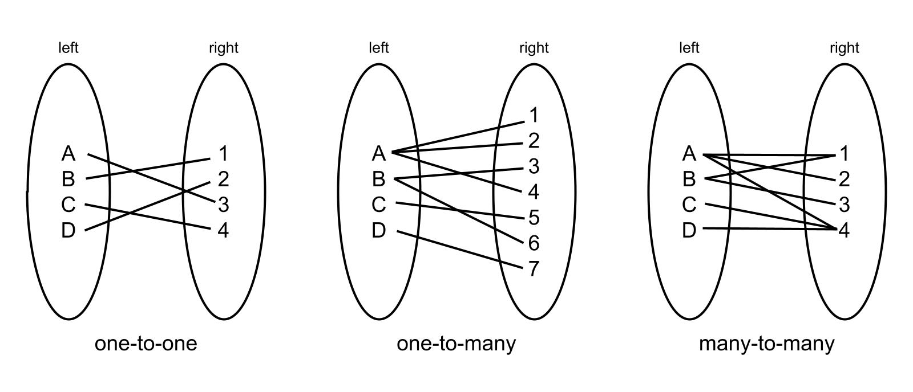
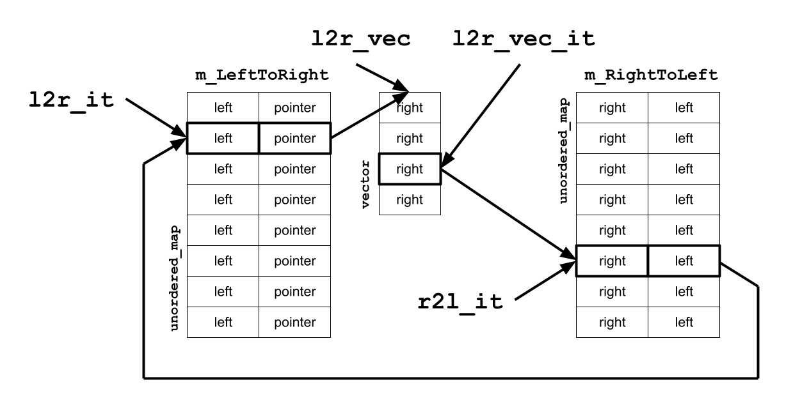

Binary relations are everywhere
===============================

What is this?
-------------

This is a small C++ library (a single header file) that adds three new
associative container types that help you organize and query data in memory.

-   Released under MIT License.

-   [Click here for the
    documentation.](https://ronpieket.github.io/BinaryRelations/class_binary_relations_1_1_one_to_many.html)

-   [Click here for the GitHub
    repo.](https://github.com/RonPieket/BinaryRelations)

-   This library uses `std::vector` and `std::unordered_map`.

Intro
-----

There is a data structure I use that has served me very well for many years in
the Insomniac Core tools group. I don’t hear other programmers refer to it, so I
want to introduce it to you. I call it a binary relation. It’s a bidirectional
associative container.

The term “binary relation” and the concept are borrowed from mathematics,
specifically set theory. But this is not a library for mathematicians. It is for
programmers needing to organize their data.

A quick refresher
-----------------

Binary relations are the association between elements of two sets. It can be
seen as a set consisting of related pairs (x,y) where x is the input or the
domain and where y is the output or the range. The notation x R y means that x
is related to y by R, where R can be the relation that links x and y.

In this library x and y are called left and right, indicating their position in
the diagram.

There are four kinds of binary relations. They are: one-to-one, one-to-many,
many-to-one, and many-to-many. But because one-to-many and many-to-one are
interchangeable if you swap the left and the right side, we ignore many-to-one.
You won’t need it, as will become clear later.

Real world examples
-------------------

The real world examples come from my experience as a game tools programmer,
specifically as a programmer of the Insomniac world editor. So I will use that
as an example.

So in the world editor then, every object in the world is represented by a
handle. They need to be organized at the global level. For example, objects can
be connected in a parent-child relationship. A parent object can have any number
of children. Each child has exactly one parent. This is a binary relation, a
one-to-many. And each child may itself be a parent and have children. So we have
a hierarchy tree.

Typically, this is kind of relationship is expressed in the object data itself.
Every object that is a child contains a handle (or pointer) to a parent. And
each parent contains an array of handles (or pointers) to its children.

~~~~~~~~~~~~~~~~~~~~~~~~~~~~~~~~~~~~~~~~~~~~~~~~~~~~~~~~~~~~~~~~~~~~~~~~~~~~~~~~
class GameObject
{
    Handle m_Parent;
    std::vector<Handle> m_Children;
    ...
};
~~~~~~~~~~~~~~~~~~~~~~~~~~~~~~~~~~~~~~~~~~~~~~~~~~~~~~~~~~~~~~~~~~~~~~~~~~~~~~~~

This organization requires that when a child changes parent, you need to update
both the `m_Parent` of the child as well as the `m_Children` list of the parent.
This kind of connection is a one-to-many binary relation. With binary relations,
the relationship between parents and children is stored outside of the object
data structure, in its own container. All parent-to-child relationships are
stored in one container that lives alongside the game objects.

~~~~~~~~~~~~~~~~~~~~~~~~~~~~~~~~~~~~~~~~~~~~~~~~~~~~~~~~~~~~~~~~~~~~~~~~~~~~~~~~
class World
{
    OneToMany<Handle, Handle> m_ParentToChildren;
    ...
};
~~~~~~~~~~~~~~~~~~~~~~~~~~~~~~~~~~~~~~~~~~~~~~~~~~~~~~~~~~~~~~~~~~~~~~~~~~~~~~~~

With this data structure, you can look up the parent handle for any object, and
get a list of handles of its children.

This is a key concept, and I want to emphasize it here: relations between
objects (such as parent-child) are not stored in the objects, but in a separate
worldwide relationship table.

Binary relations are everywhere
-------------------------------

Once you get the hang of storing relationships outside of the objects, you will
find uses for it everywhere. For example, game objects can be member of multiple
groups. That’s a many-to-many. Given the group’s handle, you can look up all its
members. And when you have a game object, you can get a list of the groups it
belongs to.

Perhaps a more surprising example is this. Say you have an object type to
classify people, vehicles, and buildings. This, too, is a binary relation. In
this case it’s a one-to-many. Given an object handle, you can look up what type
it is. Given an object type, you can get a list of all objects of that type.

Here are some more use cases:

~~~~~~~~~~~~~~~~~~~~~~~~~~~~~~~~~~~~~~~~~~~~~~~~~~~~~~~~~~~~~~~~~~~~~~~~~~~~~~~~
class World
{
    OneToMany<Handle, Handle>     m_ParentToChildren;
    OneToMany<ZoneId, Handle>     m_ZoneToObjects;
    OneToMany<ObjectType, Handle> m_TypeToObjects;
    OneToMany<AssetInfo, Handle>  m_AssetToObjects;
    OneToMany<AssetInfo, Handle>  m_ZoneToObjects;
    OneToMany<Handle, Handle>     m_PrefabToObjects;
    OneToMany<AssetType, Handle>  m_AssetTypeToObjects;
    ...
    ManyToMany<Handle, Handle>    m_GroupsToObjects;
    ManyToMany<QuestId, Handle>   m_QuestsToGroups;
    ...
};
~~~~~~~~~~~~~~~~~~~~~~~~~~~~~~~~~~~~~~~~~~~~~~~~~~~~~~~~~~~~~~~~~~~~~~~~~~~~~~~~

The API
-------

The library is located in the BinaryRelations directory. It consists of a single
C++ header file. There are three class templates that you need to know of. The
classes are: `OneToMany`, `ManyToMany`, and `OneToOne`.

Each binary relation type is a template, with type arguments `LeftType` and
`RightType`. **Both types need to be small, hashable, and immutable.** I
recommend that you only use simple types, such as `int` and `enum`, and possibly
`std::string`.

This is the entire `OneToMany` API. `OneToOne` and `ManyToMany` are near
identical. [Click here for the full
documentation.](https://ronpieket.github.io/BinaryRelations)

~~~~~~~~~~~~~~~~~~~~~~~~~~~~~~~~~~~~~~~~~~~~~~~~~~~~~~~~~~~~~~~~~~~~~~~~~~~~~~~~
OneToMany:

void     insert(const Pair &pair)
void     insert(const LeftType &left, const RightType &right)
void     insert(const OneToMany<LeftType, RightType> &other)
void     erase(const Pair &pair)
void     erase(const LeftType &left, const RightType &right)
void     eraseLeft(const LeftType &left)
void     eraseRight(const RightType &right)
void     erase(const OneToMany<LeftType, RightType> &other)
void     clear()
bool     contains(const Pair &pair) const
bool     contains(const LeftType &left, const RightType &right) const
bool     containsLeft(const LeftType &left) const
bool     containsRight(const RightType &right) const
int      countLeft() const
int      countRight() const
int      count() const

UnorderedMapHelper<LeftType, std::vector<RightType> *> allLeft()

UnorderedMapHelper<RightType, LeftType> allRight()

LeftType findLeft(const RightType &right, const LeftType &notFoundValue)

const std::vector<RightType>* findRight(const LeftType &left) const noexcept
~~~~~~~~~~~~~~~~~~~~~~~~~~~~~~~~~~~~~~~~~~~~~~~~~~~~~~~~~~~~~~~~~~~~~~~~~~~~~~~~

Installation and usage
----------------------

~~~~~~~~~~~~~~~~~~~~~~~~~~~~~~~~~~~~~~~~~~~~~~~~~~~~~~~~~~~~~~~~~~~~~~~~~~~~~~~~
#include "BinaryRelations/BinaryRelations.h"
~~~~~~~~~~~~~~~~~~~~~~~~~~~~~~~~~~~~~~~~~~~~~~~~~~~~~~~~~~~~~~~~~~~~~~~~~~~~~~~~

That’s all.

Code example
------------

~~~~~~~~~~~~~~~~~~~~~~~~~~~~~~~~~~~~~~~~~~~~~~~~~~~~~~~~~~~~~~~~~~~~~~~~~~~~~~~~
    enum VehicleMake { kUnknownMake, kVolvo, kNissan, kFord };
    enum OccupantType { kUnknownType, kDriver, kPassenger };

    OneToMany<VehicleMake, std::string> VehicleToOccupants;
    OneToMany<OccupantType, std::string> TypeToOccupants;

    VehicleToOccupants.insert(kVolvo, "Liz");
    VehicleToOccupants.insert(kVolvo, "Joe");
    VehicleToOccupants.insert(kVolvo, "Sal");
    VehicleToOccupants.insert(kNissan, "Ben");
    VehicleToOccupants.insert(kNissan, "Eva");
    VehicleToOccupants.insert(kFord, "Amy");

    TypeToOccupants.insert(kDriver, "Liz");
    TypeToOccupants.insert(kPassenger, "Joe");
    TypeToOccupants.insert(kPassenger, "Sal");
    TypeToOccupants.insert(kDriver, "Ben");
    TypeToOccupants.insert(kPassenger, "Eva");
    TypeToOccupants.insert(kDriver, "Amy");

    // List just the drivers

    std::cout << "Drivers are:" << std::endl;
    for (std::string name : *TypeToOccupants.findRight(kDriver))
        std::cout << name << std::endl;

    // List all occupant info

    std::cout << "Occupants are:" << std::endl;
    for (std::string name : VehicleToOccupants.allRight())
        std::cout << name
        << " is a " << TypeToOccupants.findLeft(name, kUnknownType)
        << " in the " << VehicleToOccupants.findLeft(name, kUnknownMake)
        << std::endl;

    // List all vehicles

    std::cout << "Vehicles are:" << std::endl;
    for (auto vehicle : VehicleToOccupants.allLeft())
        std::cout << vehicle << std::endl;
~~~~~~~~~~~~~~~~~~~~~~~~~~~~~~~~~~~~~~~~~~~~~~~~~~~~~~~~~~~~~~~~~~~~~~~~~~~~~~~~

Output:

~~~~~~~~~~~~~~~~~~~~~~~~~~~~~~~~~~~~~~~~~~~~~~~~~~~~~~~~~~~~~~~~~~~~~~~~~~~~~~~~
Drivers are:
Amy
Ben
Liz
Occupants are:
Amy is a 1 in the 3
Eva is a 2 in the 2
Ben is a 1 in the 2
Joe is a 2 in the 1
Sal is a 2 in the 1
Liz is a 1 in the 1
Vehicles are:
3
2
1
~~~~~~~~~~~~~~~~~~~~~~~~~~~~~~~~~~~~~~~~~~~~~~~~~~~~~~~~~~~~~~~~~~~~~~~~~~~~~~~~

Naming of template specializations
----------------------------------

In the code example, note that the name of the `OneToMany` has the form of
“SingularToPlural”, like “ParentToChildren”. Similarly, ManyToMany names would
be “PluralToPlural”, OneToOne would be “SingularToSingular”.

Efficiency
----------

The efficiency for lookup such as `FindLeft()` and `FindRight()` is constant
time, or O(1). All operations on a `OneToOne` are also constant.

Things get more complicated with `OneToMany` and `ManyToMany`. They maintain
sorted arrays. Insertion and erasure of elements in an array involves shifting
everything between the point of insertion/erasure and the end of the array. This
is O(n).

There is a new bulk insert/erase that will speed up insertions and erasures by
bundling them up. (Optimized algorithm only implemented for `OneToMany`. To do
`ManyToMany`)

Performance
-----------

Performance measurements in Xcode on an iMac M1, release build.

### Worst case insert

The “worst case” is inserting random numbers on the right with the same left
value. The one-to-many uses the optimized bulk insert. Results in milliseconds.

|           | one-to-one | one-to-many | many-to-many |
|-----------|------------|-------------|--------------|
| 10        | 0.068333   | 0.152083    | 0.067542     |
| 100       | 0.2425     | 0.209416    | 0.450292     |
| 1,000     | 2.20312    | 1.26733     | 4.82071      |
| 10,000    | 17.2593    | 8.92692     | 28.9023      |
| 100,000   | 77.019     | 46.892      | 365.9        |
| 1,000,000 | 739.4      | 662.998     | 21,592.2     |

### Best case insert

The “best case” is inserting random numbers on both the left and right. Results
in milliseconds.

|           | one-to-one | one-to-many | many-to-many |
|-----------|------------|-------------|--------------|
| 10        | 0.005542   | 0.005625    | 0.00575      |
| 100       | 0.03325    | 0.042167    | 0.039875     |
| 1,000     | 0.25875    | 0.306125    | 0.354167     |
| 10,000    | 2.37317    | 2.64029     | 3.25633      |
| 100,000   | 20.2791    | 18.3426     | 30.7384      |
| 1,000,000 | 454.936    | 601.014     | 780.828      |

### Lookup

This is the time it takes for a single lookup in tables of different sizes.
Results microseconds.

|           | one-to-one | one-to-many | many-to-many |
|-----------|------------|-------------|--------------|
| 10        | 0.049725   | 0.04265     | 0.0369667    |
| 100       | 0.0334625  | 0.0351042   | 0.0344917    |
| 1,000     | 0.0370417  | 0.0376333   | 0.0379292    |
| 10,000    | 0.0473625  | 0.0477541   | 0.04305      |
| 100,000   | 0.0406292  | 0.0389792   | 0.0372666    |
| 1,000,000 | 0.0652959  | 0.0715042   | 0.0902375    |

### Thoughts on performance

`std::unordered_map` is not the fastest hash map. I’m aware of faster ones, but
all those I have found have a license that is more restrictive than the MIT
license.

How it works
------------

This section is for those who want to venture into the code.

I will show you, and talk you through the structure of the `OneToMany` template
class. The `OneToOne` and `ManyToMany` template classes are structured along the
same lines.

I used the above diagram to write the code. The `l2r_it` style labels refer to
local variable names in the code. `m_LeftToRight` and `m_RightToLeft` are both
hash tables. Each entry on the `m_LeftToRight` table contains a `std::pair` with
a left value in the `first` slot, and a pointer to a `std::vector` in the
`second`. The `vector` has one or more `right` values in it, sorted by value.
The `m_RightToLeft` hash table contains `pair`s with a `right` value in the
`first` slot, and a `left` value in the `second` slot.

When `findRight()` is called, the `OneToMany` is returns the pointer to the
`vector` of `right` values from the `second` slot in the `m_LeftToRight` hash
table. When `findLeft()` is called, it returns the `left` value from the
`second` slot in the `m_RightToLeft` hash table.
