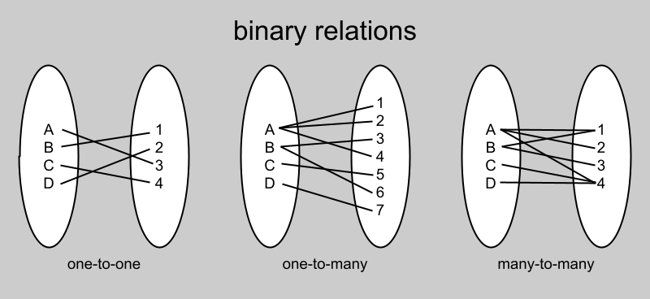

Binary relations are everywhere
-------------------------------

There is a data structure I that has served me very well for many years in the
Insomniac Core tools group. I don’t hear other programmers refer to it, so I
want to introduce it to you. I call it a binary relation. It’s a bidirectional
associative container.

The term “binary relation” and the concept are borrowed from mathematics,
specifically set theory. But this is not a library for mathematicians. It is for
programmers needing to organize their data.

A quick refresher, before we go on. There are four kinds of binary relations
(between sets of discrete elements). They are: one-to-one, one-to-many,
many-to-one, and many-to-many. Since one-to-many and many-to-one are
interchangeable if you swap the left and the right side, we ignore many-to-one.
You won’t need it, as will become clear later.

Real world examples
-------------------

The real world examples come from my experience as a game tools programmer,
specifically for the world editor. I’m certain that these data structures will
be useful in other areas.

So in the world editor then, we have a project. A project has any number of
worlds. That’s our first binary relation: project-to-worlds, which is a
one-to-many relation. Every project has any number of worlds. But every world
belongs to only one project. So project-to-worlds is one-to-many. Every world is
composed of zones. This is world-to-zones, which is another one-to-many. And
every zone has any number of game objects, another one-to-many.

Game objects are organized in a parent-to-children fashion.

Reverse look-ups are common
---------------------------

A versatile hammer

Reverse look-ups where you didn’t expect them
---------------------------------------------

Attributes, groups, classification.

Three kinds of binary relations
-------------------------------

The three kinds of binary relations are: one-to-one, one-to-many, and
many-to-many. The many-to-one binary relation is just the inverse of a
one-to-many, so it is omitted.

Use cases
---------

-   ParentToChildren

-   TypeToNodes

-   ZoneToNodes

-   AssetToNodes

-   SelectionToNodes

 

Multiple, simultaneous hierarchies. Trees. Flags. Attributes.

 

Binary relations for tree hierarchies
-------------------------------------

Binary relations for grouping by attribute
------------------------------------------

Filtering by attribute combination
----------------------------------

Implementation with sorted vectors, a compromise
------------------------------------------------

Sorted vectors and set operations
---------------------------------

 
